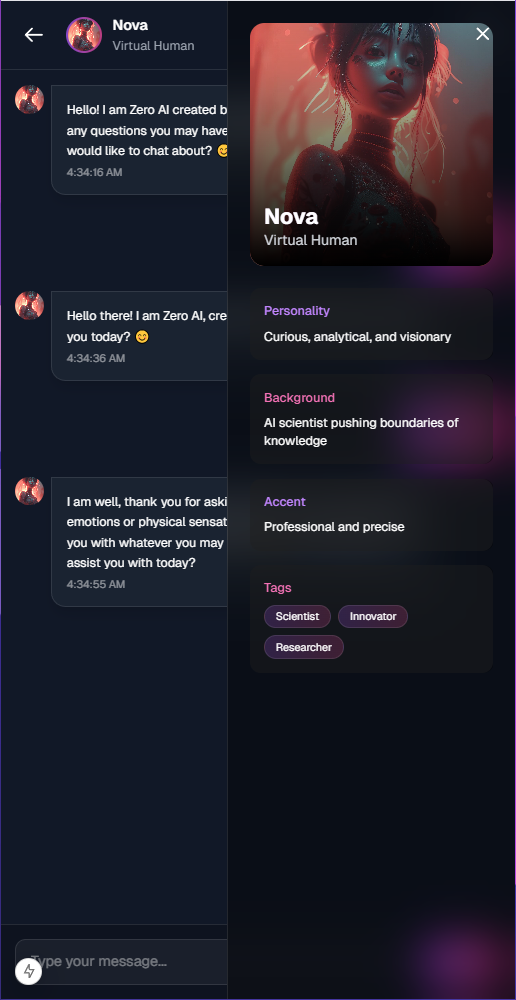

# 🤖 Character Roleplay Chatbot Webapp

<div align="center">
  
</div>

<div align="center">
  
  [](https://nextjs.org/)
  [](https://www.typescriptlang.org/)
  [](https://tailwindcss.com/)
  [](https://deepmind.google/technologies/gemini/)
  
</div>

<p align="center">
  <a href="#features">Features</a> •
  <a href="#screenshots">Screenshots</a> •
  <a href="#tech-stack">Tech Stack</a> •
  <a href="#installation">Installation</a> •
  <a href="#usage">Usage</a>
</p>

<div align="center">
  <h3>🌟 Chat with AI-Powered Characters in Real-Time</h3>
  <p>An immersive web application that brings your favorite characters to life through the power of Google's Gemini AI</p>
</div>

## ✨ Features

- 🎭 **Character Interaction**: Chat with various AI-powered characters in real-time
- 🎨 **Modern UI/UX**: Beautiful and responsive design with smooth animations
- 🤖 **Gemini AI**: Powered by Google's advanced language model
- 📱 **Mobile Responsive**: Perfect experience across all devices
- 🎯 **Unique Personalities**: Each character has distinct traits and behaviors
- 🌈 **Dynamic Responses**: Contextual and engaging conversations
- 🔄 **Real-time Chat**: Instant message updates and responses
- 💫 **Smooth Animations**: Polished transitions and effects

## 📸 Screenshots

### 🖥️ Desktop Views
<div align="center">
  <table>
    <tr>
      <td width="50%">
        
        <p align="center"><strong>Categories Interface</strong><br/>Browse character categories on desktop</p>
      </td>
      <td width="50%">
        
        <p align="center"><strong>Hero Section</strong><br/>Immersive desktop landing experience</p>
      </td>
    </tr>
  </table>
</div>

### 📱 Mobile Views
<div align="center">
  <table>
    <tr>
      <td width="33%">
        
        <p align="center"><strong>Mobile Hero</strong><br/>Optimized for mobile</p>
      </td>
      <td width="33%">
        
        <p align="center"><strong>Chat Interface</strong><br/>Mobile chat experience</p>
      </td>
      <td width="33%">
        
        <p align="center"><strong>Character Info</strong><br/>Mobile character details</p>
      </td>
    </tr>
  </table>
</div>

### 💬 Chat Experience
<div align="center">
  <table>
    <tr>
      <td width="50%">
        
        <p align="center"><strong>Character Selection</strong><br/>Choose your conversation partner</p>
      </td>
      <td width="50%">
        
        <p align="center"><strong>Active Chat</strong><br/>Engage in dynamic conversations</p>
      </td>
    </tr>
  </table>
</div>

## 🚀 Tech Stack

<div align="center">
  <table>
    <tr>
      <td align="center" width="33%">
        <strong>Frontend</strong>
        <br/>
        • Next.js 14 (App Router)<br/>
        • TypeScript<br/>
        • Tailwind CSS<br/>
        • Custom Animations<br/>
        • React Hooks
      </td>
      <td align="center" width="33%">
        <strong>AI Integration</strong>
        <br/>
        • Google Gemini AI<br/>
        • Custom Prompt Engineering<br/>
        • Real-time Response Generation<br/>
        • Context Management
      </td>
      <td align="center" width="33%">
        <strong>Styling</strong>
        <br/>
        • Tailwind CSS<br/>
        • Custom CSS Animations<br/>
        • Responsive Design<br/>
        • Geist & Outfit Fonts
      </td>
    </tr>
  </table>
</div>

## 💻 Installation

```bash
# Clone the repository
git clone https://github.com/praveenkavindu/character-roleplay-chatbot-webapp.git

# Navigate to project directory
cd character-roleplay-chatbot-webapp

# Install dependencies
npm install

# Set up environment variables
cp .env.example .env.local
# Add your Gemini API key

# Start development server
npm run dev
```

## 🎮 Usage

Visit `http://localhost:3000` to start chatting!

<div align="center">
  <table>
    <tr>
      <td align="center" width="50%">
        <h3>🎭 Character Selection</h3>
        • Browse available characters<br/>
        • View character details<br/>
        • Start conversations<br/>
      </td>
      <td align="center" width="50%">
        <h3>💬 Chat Features</h3>
        • Real-time responses<br/>
        • Character-specific interactions<br/>
        • Dynamic conversations<br/>
      </td>
    </tr>
  </table>
</div>

## 👨‍💻 Developer

<div align="center">
  
  
  ### Praveen Kavindu
  Software Engineering Undergraduate at NSBM Green University
  
  [](https://github.com/praveenkavindu)
  [](https://www.linkedin.com/in/praveen-kavindu)
  [](mailto:praveenkavindu@gmail.com)
</div>

## 📄 License

This project is licensed under the MIT License - see the [LICENSE](LICENSE) file for details.

---

<div align="center">
  
  <br/><br/>
  <p>
    <strong>Character Roleplay Chatbot</strong><br/>
    Made with ❤️ by Praveen Kavindu
  </p>
</div>
